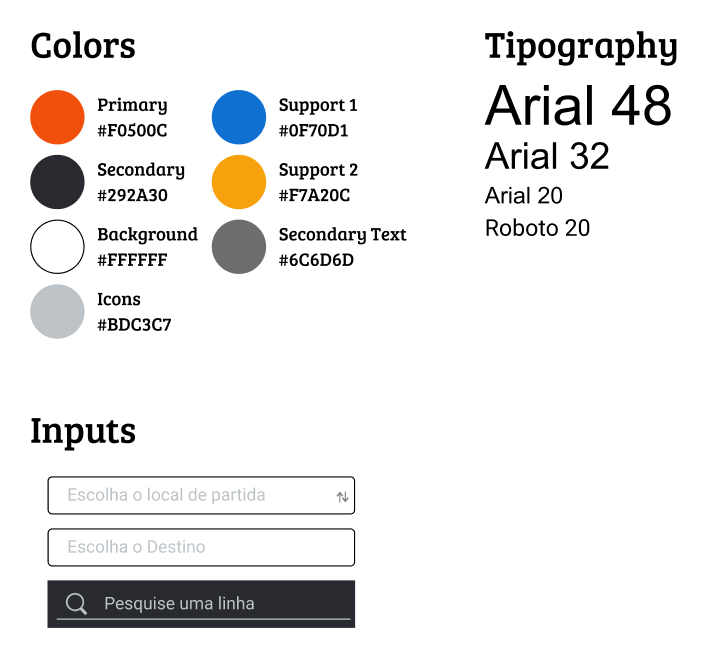

# Design System - [Moovit Website](https://moovitapp.com/)

Este documento foi elaborado como parte de uma atividade para a disciplina de **Interação Humano-Computador (IHC)**. Ele mapeia o design system do site já desenvolvido do [Moovit](https://moovitapp.com/), servindo como base para futuras alterações que visem melhorar a interação humano-computador. O objetivo é ter um acesso rápido às informações de design visual e funcional para apoiar no processo de análise e melhoria.

---

---

## **Acesso ao Design System no Figma**
Para visualizar e explorar o design system completo no Figma, acesse o link abaixo:  

**[Design System no Figma - Moovit Web](https://www.figma.com/design/3odzQA0HazLkBSaQqo0F5o/Moovit-Web?node-id=0-1&m=dev&t=SZOPFesveN7xFH7h-1)**

---

## **Cores**
O sistema de cores foi identificado no site e reflete a identidade visual aplicada. As cores são classificadas em primárias, secundárias e de suporte.

- **Primária**:  `#F0500C`  
  Utilizada como destaque principal no site.
  
- **Secundária**:  `#292A30`  
  Cor complementar, usada em textos e áreas de menor destaque.

- **Fundo (Background)**:  `#FFFFFF`  
  Cor de fundo principal para contraste e legibilidade.

- **Ícones**:  `#BDC3C7`  
  Cor aplicada em ícones para criar um design neutro.

- **Texto Secundário**:  `#6C6D6D`  
  Cor de texto menos prioritária para informações auxiliares.

- **Suporte 1**:  `#0F70D1`  
  Utilizada em elementos de destaque ou como cor alternativa.

- **Suporte 2**:  `#F7A20C`  
  Cor secundária adicional para elementos específicos.

---

## **Tipografia**
A tipografia do site é baseada em fontes limpas e modernas, garantindo boa legibilidade e hierarquia visual.

- **Títulos Principais**:  
  - Fonte: Arial  
  - Tamanho: 48px  

- **Subtítulos**:  
  - Fonte: Arial  
  - Tamanho: 32px  

- **Textos Secundários**:  
  - Fonte: Arial  
  - Tamanho: 20px  

- **Outros Textos**:  
  - Fonte: Roboto  
  - Tamanho: 20px  

A escolha de fontes padrão como Arial e Roboto garante consistência e compatibilidade em diferentes navegadores.

---

## **Inputs**
Os campos de entrada seguem um design funcional e acessível, com placeholders claros para guiar o usuário.

1. **Campo "Escolha o local de partida"**:  
   - Placeholder claro para orientar o usuário.
   - Ícone de seta indicando interação.

2. **Campo "Escolha o Destino"**:  
   - Simples e limpo, com bordas finas para não desviar atenção.

3. **Barra de Pesquisa**:  
   - Fundo escuro () com texto claro para contraste.
   - Placeholder: "Pesquise uma linha".

Esses inputs foram projetados para oferecer uma experiência clara, intuitiva e visualmente consistente.

---

## **Objetivo do Trabalho**
Este design system foi documentado como base para o processo de melhoria do site [Moovit](https://moovitapp.com/), com foco na interação humano-computador. O objetivo é propor alterações fundamentadas que aprimorem a usabilidade, acessibilidade e experiência do usuário. Ter um documento consolidado facilita o acesso rápido às informações essenciais do design existente e guia a análise crítica e o redesign.
